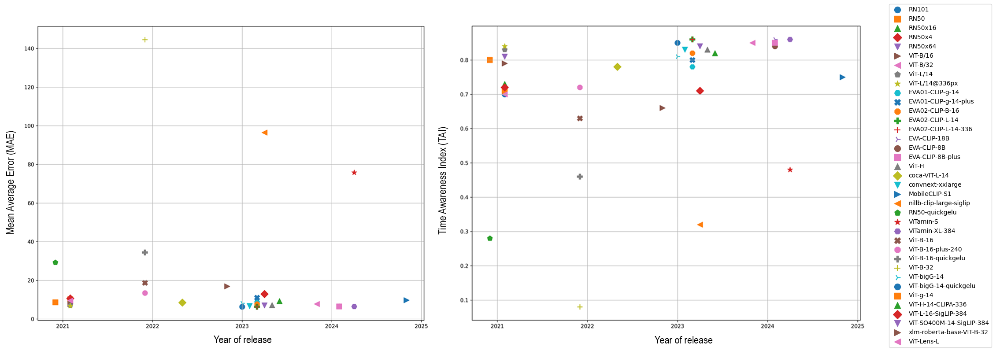

# A Matter of Time: Revealing the Structure of Time in Vision-Language Models

[](https://www.python.org/downloads/)
[](LICENSE)
<a href="https://arxiv.org/pdf/2510.19559" target="_blank"></a>
<a href="https://dl.acm.org/doi/10.1145/3746027.3758163" target="_blank"></a>
<a href="https://osf.io/4th79/?view_only=560f540a7bac4d489faf164b16109642" target="_blank"></a>


This repository contains the official implementation of **"A Matter of Time: Revealing the Structure of Time in Vision-Language Models"**.

---

## 🚧 **Coming Soon!**

**📦 Full code implementation will be released shortly**  
**📥 Dataset download script will be included**

Stay tuned for updates!

---

## 📄 Abstract

Large-scale vision-language models (VLMs) such as CLIP have gained popularity for their generalizable and expressive multimodal representations. By leveraging large-scale training data with diverse textual metadata, VLMs acquire open-vocabulary capabilities, solving tasks beyond their training scope. This paper investigates the temporal awareness of VLMs, assessing their ability to position visual content in time. We introduce TIME10k, a benchmark dataset of over 10,000 images with temporal ground truth, and evaluate the time-awareness of 37 VLMs by a novel methodology. Our investigation reveals that temporal information is structured along a low-dimensional, non-linear manifold in the VLM embedding space. Based on this insight, we propose methods to derive an explicit "timeline" representation from the embedding space. These representations model time and its chronological progression and thereby facilitate temporal reasoning tasks. Our timeline approaches achieve competitive to superior accuracy compared to a prompt-based baseline while being computationally efficient.

## 🚀 Key Features

- **TIME10k Dataset**: 10,000+ temporally annotated images across 6 object categories
- **Comprehensive Evaluation**: Time-awareness assessment of 37 state-of-the-art VLMs
- **Novel Timeline Modeling**: UMAP and Bézier curve-based approaches for temporal representation
- **Efficient Inference**: Timeline methods achieve competitive accuracy while being computationally efficient

## 📊 Performance Overview



## 🗂️ TIME10k Dataset

The TIME10k dataset contains 10,091 images across 6 categories:
- Cars (4,393)
- Mobile Phones (4,337)
- Ships (841)
- Musical Instruments (436)
- Aircraft (69)
- Weapons & Ammunition (15)

Access the dataset: <a href="https://osf.io/4th79/?view_only=560f540a7bac4d489faf164b16109642" target="_blank">TIME10k on OSF</a>

A download script will be provided to facilitate dataset access.

## 📝 Citation

If you find this work useful, please cite:

```bibtex
@inproceedings{10.1145/3746027.3758163,
  author = {Tekaya, Nidham and Waldner, Manuela and Zeppelzauer, Matthias},
  title = {A Matter of Time: Revealing the Structure of Time in Vision-Language Models},
  year = {2025},
  isbn = {9798400720352},
  publisher = {Association for Computing Machinery},
  address = {New York, NY, USA},
  url = {https://doi.org/10.1145/3746027.3758163},
  doi = {10.1145/3746027.3758163},
  booktitle = {Proceedings of the 33rd ACM International Conference on Multimedia},
  pages = {12371–12380},
  numpages = {10},
  keywords = {benchmark dataset, multimodal representations, time estimation, time modeling, time reasoning, vision-language models},
  location = {Dublin, Ireland},
  series = {MM '25}
}
```

## 🔗 Links

- <a href="https://dl.acm.org/doi/10.1145/3746027.3758163" target="_blank">Paper (ACM Digital Library)</a>
- <a href="https://arxiv.org/pdf/2510.19559" target="_blank">arXiv Preprint</a>
- <a href="https://tekayanidham.github.io/timeline-page/" target="_blank">Project Page</a>
- <a href="https://osf.io/4th79/?view_only=560f540a7bac4d489faf164b16109642" target="_blank">TIME10k Dataset</a>

## 🤝 Contributing

We welcome contributions! Please see [CONTRIBUTING.md](CONTRIBUTING.md) for guidelines.

## 📄 License

This project is licensed under the MIT License - see the [LICENSE](LICENSE) file for details.

---

For questions or issues, please open an issue on GitHub or contact <a href="mailto:nidham.tekaya@fhstp.ac.at">nidham.tekaya@fhstp.ac.at</a>.
