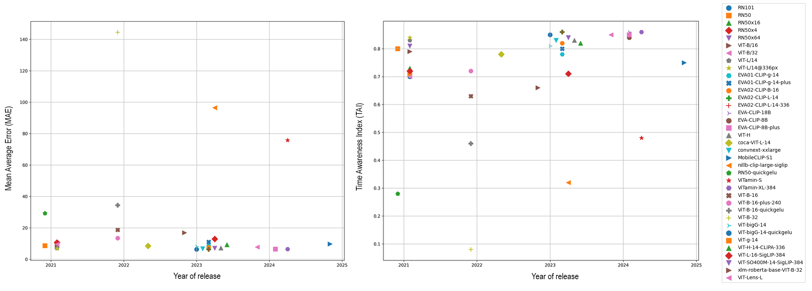

# A Matter of Time: Revealing the Structure of Time in Vision-Language Models

[](https://www.python.org/downloads/)
[](LICENSE)
<a href="https://arxiv.org/pdf/2510.19559" target="_blank"></a>
<a href="https://dl.acm.org/doi/10.1145/3746027.3758163" target="_blank"></a>
<a href="https://osf.io/4th79/?view_only=560f540a7bac4d489faf164b16109642" target="_blank"></a>


Official implementation of **"A Matter of Time: Revealing the Structure of Time in Vision-Language Models"**, published at ACM Multimedia 2025 (MM '25).

> We investigate the temporal awareness of VLMs, assessing their ability to position visual content in time. We introduce **TIME10k**, a benchmark of over 10,000 images with temporal ground truth, and evaluate **37 VLMs**. We reveal that temporal information is structured along a low-dimensional, non-linear manifold in the VLM embedding space. We propose methods to derive an explicit "timeline" representation using **UMAP** and **Bezier curve** approximation, achieving competitive to superior accuracy while being computationally efficient.



---

## Quick Start

**Predict the year of any image in 3 lines:**

```python
from timeline_vlm import TimelinePredictor

predictor = TimelinePredictor('clip-vit-b32').fit_from_precomputed('encodings')
print(predictor.predict('photo.jpg'))  # → 1972
```

**Or from the command line:**

```bash
python predict.py --image photo.jpg
```

No GPU required — precomputed embeddings for CLIP and EVA-CLIP are included.

---

## Installation

```bash
git clone https://github.com/tekayanidham/timeline-vlm.git
cd timeline-vlm
pip install -r requirements.txt
pip install git+https://github.com/openai/CLIP.git
```

For all 37 models (including ImageBind and ViT-Lens):
```bash
bash install_models.sh
```

Verify the installation:
```bash
python run_experiments.py --config configs/lightweight_test.yaml --device cpu
```

---

## Repository Structure

```
timeline-vlm/
│
│   # ── Entry Points ──────────────────────────────────────────────
├── predict.py                 # Predict year for images (CLI)
├── timeline_vlm.py            # Python API for your pipelines
├── reproduce_results.py       # Reproduce specific paper tables/figures
├── visualize.py               # Visualize timelines and embeddings
├── run_experiments.py         # Full experiment orchestrator (YAML-driven)
│
│   # ── Core Modules ──────────────────────────────────────────────
├── evaluation/                # Temporal inference methods
│   ├── time_probing.py        #   Baseline: dot-product similarity (Sec. 3.1)
│   ├── timeline_umap.py       #   UMAP 1D timeline (Sec. 3.3.1)
│   ├── timeline_bezier.py     #   Bézier curve timeline (Sec. 3.3.2)
│   ├── embedding_space.py     #   Embedding analysis (Sec. 3.2)
│   ├── embeddings.py          #   Embedding generation & caching
│   └── README.md
├── models/                    # Vision-Language Model loading
│   ├── model_loader.py        #   Unified loader for 37 VLMs
│   └── README.md
├── utils/                     # Shared utilities
│   ├── metrics.py             #   TAI, MAE, ranking metrics (Sec. 5.4)
│   ├── prompts.py             #   Prompt templates P1-P9 (Table 2)
│   └── README.md
├── data/                      # Dataset management
│   ├── dataset.py             #   TIME10k dataset loader
│   ├── download.py            #   Download images from Wikimedia
│   ├── time10k.csv            #   Dataset metadata (10,091 entries)
│   └── README.md
│
│   # ── Configuration ─────────────────────────────────────────────
├── configs/                   # YAML experiment configs
│   ├── full_evaluation.yaml   #   All 37 models, all experiments
│   ├── lightweight_test.yaml  #   CPU-friendly quick test
│   └── README.md
│
│   # ── Data ──────────────────────────────────────────────────────
├── encodings/                 # Precomputed embeddings (CLIP, EVA-CLIP)
└── results/                   # Output directory
```

Each subfolder has its own `README.md` with detailed documentation. Start with [`evaluation/README.md`](evaluation/README.md) to understand the methods.

---

## Which Script Should I Use?

| I want to... | Use this | Example |
|---|---|---|
| **Predict the year of an image** | `predict.py` | `python predict.py --image photo.jpg` |
| **Use this in my Python code** | `timeline_vlm.py` | `from timeline_vlm import TimelinePredictor` |
| **Reproduce a specific paper table** | `reproduce_results.py` | `python reproduce_results.py --table 5` |
| **Visualize timelines or embeddings** | `visualize.py` | `python visualize.py timeline` |
| **Run all experiments end-to-end** | `run_experiments.py` | `python run_experiments.py --config configs/full_evaluation.yaml` |

---

## Predicting Year of First Appearance

### Command Line

```bash
# Default: CLIP ViT-B/32, Bézier R^S method
python predict.py --image photo.jpg

# Choose model and method
python predict.py --image photo.jpg --model eva-clip-l14-336 --method bezier

# Time probing (direct similarity matching)
python predict.py --image photo.jpg --method time_probing --prompt P7

# Batch prediction on a directory
python predict.py --image_dir my_photos/ --output json

# UMAP timeline method
python predict.py --image photo.jpg --method umap

# Custom Bézier settings
python predict.py --image photo.jpg --reduce_dim 13 --bezier_method interpolation

# Save results
python predict.py --image_dir photos/ --output csv --save results.csv
```

### Python API

```python
from timeline_vlm import TimelinePredictor

# Initialize and fit
predictor = TimelinePredictor(
    model='clip-vit-b32',       # Any of the 37 supported models
    method='bezier',            # 'time_probing', 'umap', or 'bezier'
    reduce_dim=13,              # KPCA dimensions (Bézier only)
    bezier_method='interpolation',
)
predictor.fit_from_precomputed('encodings')

# Single prediction
year = predictor.predict('photo.jpg')

# Batch prediction
years = predictor.predict_batch(['img1.jpg', 'img2.jpg', 'img3.jpg'])

# Detailed prediction with confidence
details = predictor.predict_with_details('photo.jpg')
# {'predicted_year': 1972, 'model': 'clip-vit-b32', 'method': 'bezier', 'inference_ms': 4.2}

# Evaluate on your own data
results = predictor.evaluate(image_embeddings, ground_truth_years)
print(f"MAE: {results['mae']:.2f}, TAI: {results['tai']:.3f}")
```

---

## Reproducing Paper Results

### Quick: Specific Tables

```bash
python reproduce_results.py --table 5                          # Table 5 only
python reproduce_results.py --table 4 5                        # Tables 4 and 5
python reproduce_results.py --figure 6                         # Figure 6
python reproduce_results.py --all                              # Everything
python reproduce_results.py --table 5 --models clip-vit-b32   # Override models
```

| Flag | What it reproduces |
|---|---|
| `--table 1` | Time probing MAE & TAI for 37 VLMs (P7) |
| `--table 2` | Prompt sensitivity P1–P9 |
| `--table 3` | Class-wise temporal awareness |
| `--table 4` | Chronological ordering quality (KPCA vs UMAP) |
| `--table 5` | Method comparison: Time Probing vs UMAP vs 4 Bézier variants |
| `--figure 6` | MAE per KPCA dimension (optimal S=13) |

### Full: End-to-End Reproduction

```bash
# All experiments, all 37 models (requires GPU)
python run_experiments.py --config configs/full_evaluation.yaml

# Quick validation on CPU
python run_experiments.py --config configs/lightweight_test.yaml --device cpu

# Single experiment with specific models
python run_experiments.py --experiment timeline_comparison --models clip-vit-b32
```

---

## Visualizations

```bash
# 2D/3D embedding manifold colored by year
python visualize.py manifold --model clip-vit-b32 --save manifold.png

# 1D KPCA and UMAP timeline comparison
python visualize.py timeline --model clip-vit-b32 --save timeline.png

# 3D Bézier curve through embedding space
python visualize.py bezier --model clip-vit-b32 --reduce_dim 13 --save bezier.png

# MAE per KPCA dimension (Figure 6)
python visualize.py dimension_sweep --model clip-vit-b32 --max_dim 50 --save sweep.png

# Prediction vs ground truth distribution
python visualize.py distribution --model clip-vit-b32 --save dist.png
```

All visualizations use precomputed embeddings from `encodings/` by default.

---

## Dataset Setup

The **TIME10k** dataset contains 10,091 temporally annotated images across 6 categories (1715–2024). The CSV metadata is included in the repo; images must be downloaded separately.

```bash
# Download from Wikimedia Commons URLs
python data/download.py --csv data/time10k.csv --output data/TIME10k --workers 16
```

Or download from OSF: https://osf.io/4th79/?view_only=560f540a7bac4d489faf164b16109642

See [`data/README.md`](data/README.md) for details.

---

## Methods Overview

### Time Probing (Section 3.1) — Baseline

Direct dot-product similarity between image embedding and year-text embeddings:

**y_pred = argmax_y (I^T . T_y)**

Each year y is encoded as text using a prompt template (e.g., P7: "was built in the year {year}"). The predicted year is the one whose text embedding is most similar to the image embedding.

### UMAP Timeline (Section 3.3.1)

Projects time embeddings to a 1D manifold using UMAP with cosine metric. Image embeddings are then mapped onto this learned timeline via UMAP transform.

### Bézier Curve Timeline (Section 3.3.2)

Fits a smooth Bézier curve C(t) through chronologically-ordered time embeddings using De Casteljau's algorithm, then projects images onto the curve. Four variants:

| Variant | Space | Prediction | CLIP MAE |
|---|---|---|---|
| Bézier(R^N, NN) | Full (512-d) | Nearest neighbor | 9.28 |
| Bézier(R^N, Int) | Full (512-d) | Interpolation | 9.24 |
| Bézier(R^S, NN) | KPCA (13-d) | Nearest neighbor | 8.89 |
| **Bézier(R^S, Int)** | **KPCA (13-d)** | **Interpolation** | **8.80** |

---

## Supported Models (37 VLMs)

| Family | Models | Count |
|---|---|---|
| CLIP | RN50, RN101, RN50x4, RN50x16, RN50x64, ViT-B/16, ViT-B/32, ViT-L/14, ViT-L/14@336 | 9 |
| EVA-CLIP | EVA01-g-14, EVA01-g-14+, EVA02-B-16, EVA02-L-14, EVA02-L-14-336 | 5 |
| EVA-CLIP-18B | EVA-CLIP-8B, 8B+, 18B | 3 |
| OpenCLIP | RN50, ViT-B/16 (3 variants), XLM-RoBERTa, ViT-B/32, ViT-bigG/14 (2), ViT-G/14, ConvNeXt-XXL | 10 |
| SigLIP | ViT-L-16-384, SO400M-14-384, NLLB-large | 3 |
| Others | ImageBind, ViT-Lens, CoCa, MobileCLIP-S1, ViTamin-S, ViTamin-XL-384, CLIPA | 7 |

```bash
python run_experiments.py --list_models  # Show all model keys
```

See [`models/README.md`](models/README.md) for details on each model family.

---

## Key Metrics

- **MAE** — Mean Absolute Error in years (lower is better)
- **TAI** — Time Awareness Index, 0–1 (higher is better). Uses adaptive tolerance: 20 years for 1700, 5 years for 2024. See [`utils/README.md`](utils/README.md) for the full formula.
- **Ranking metrics** — Spearman's ρ, Kendall's τ, δ_MNDL for evaluating chronological ordering quality

---

## Citation

```bibtex
@inproceedings{10.1145/3746027.3758163,
  author = {Tekaya, Nidham and Waldner, Manuela and Zeppelzauer, Matthias},
  title = {A Matter of Time: Revealing the Structure of Time in Vision-Language Models},
  year = {2025},
  isbn = {9798400720352},
  publisher = {Association for Computing Machinery},
  address = {New York, NY, USA},
  url = {https://doi.org/10.1145/3746027.3758163},
  doi = {10.1145/3746027.3758163},
  booktitle = {Proceedings of the 33rd ACM International Conference on Multimedia},
  pages = {12371--12380},
  numpages = {10},
  keywords = {benchmark dataset, multimodal representations, time estimation, time modeling, time reasoning, vision-language models},
  location = {Dublin, Ireland},
  series = {MM '25}
}
```

## Links

- <a href="https://dl.acm.org/doi/10.1145/3746027.3758163" target="_blank">Paper (ACM Digital Library)</a>
- <a href="https://arxiv.org/pdf/2510.19559" target="_blank">arXiv Preprint</a>
- <a href="https://tekayanidham.github.io/timeline-page/" target="_blank">Project Page</a>
- <a href="https://osf.io/4th79/?view_only=560f540a7bac4d489faf164b16109642" target="_blank">TIME10k Dataset</a>

## License

This project is licensed under the MIT License - see the [LICENSE](LICENSE) file for details.
